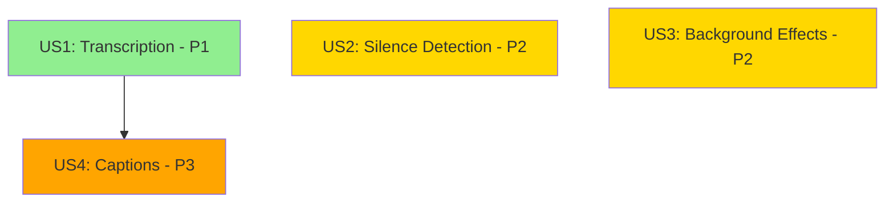

# Tasks: AI-Powered Recording Enhancements

**Input**: Design documents from `/specs/001-ai-transformer-features/`
**Prerequisites**: plan.md ✅, spec.md ✅, research.md ✅, data-model.md ✅, contracts/ ✅

**Tests**: Manual testing required for AI model integration per project constitution. Unit tests included for pure functions.

**Organization**: Tasks are grouped by user story to enable independent implementation and testing of each story.

## Format: `[ID] [P?] [Story] Description`

- **[P]**: Can run in parallel (different files, no dependencies)
- **[Story]**: Which user story this task belongs to (e.g., US1, US2, US3, US4)
- Include exact file paths in descriptions

## Path Conventions

- **Project Type**: Single web application (Vite-based)
- **Paths**: `src/` and `tests/` at repository root
- All paths shown are relative to repository root

---

## Phase 1: Setup (Shared Infrastructure)

**Purpose**: Project initialization and AI dependencies installation

- [X] T001 Install AI dependencies (@xenova/transformers, @mediapipe/tasks-vision) via bun
- [X] T002 [P] Create AI configuration file in src/lib/ai/config.ts with model URLs and thresholds
- [X] T003 [P] Create AI types file in src/lib/ai/types.ts with TypeScript interfaces
- [X] T004 [P] Create storage configuration in src/lib/storage/persistence.ts for localStorage
- [X] T005 Verify COOP/COEP headers in vite.config.ts for SharedArrayBuffer support

---

## Phase 2: Foundational (Blocking Prerequisites)

**Purpose**: Core infrastructure that MUST be complete before ANY user story can be implemented

**⚠️ CRITICAL**: No user story work can begin until this phase is complete

- [X] T006 Create base Transcript type in src/lib/ai/types.ts (TranscriptSegment, TranscriptWord, TranscriptMetadata)
- [X] T007 [P] Create base SilenceSegment type in src/lib/ai/types.ts
- [X] T008 [P] Create base Caption type in src/lib/ai/types.ts (CaptionPosition, CaptionStyle)
- [X] T009 [P] Create BackgroundEffect type in src/lib/ai/types.ts
- [X] T010 [P] Create AIProcessingJob type in src/lib/ai/types.ts with JobStatus enum
- [X] T011 Implement StorageService interface in src/lib/storage/persistence.ts with localStorage CRUD operations
- [X] T012 Add storage quota check utility function to StorageService
- [X] T013 Implement immutable state update helpers for AI data (transcript edit, silence toggle, caption style update)
- [X] T014 Create useAIProcessing hook skeleton in src/hooks/use-ai-processing.ts with job state management

**Checkpoint**: Foundation ready - user story implementation can now begin in parallel

---

## Phase 3: User Story 1 - Automatic Video Transcription (Priority: P1) 🎯 MVP

**Goal**: Auto-transcribe recordings with Whisper model, display searchable transcript, export to TXT/SRT/VTT

**Independent Test**: Record a 1-minute video with speech → verify transcript generates automatically → search for a word → export to SRT → validate accuracy ≥90%

### Implementation for User Story 1

**AI Service Implementation**

- [X] T015 [P] [US1] Create transcription worker file in src/lib/ai/transcription-worker.ts with Whisper pipeline initialization
- [X] T016 [P] [US1] Implement TranscriptionService interface in src/lib/ai/transcription.ts with Web Worker communication
- [X] T017 [US1] Add lazy model loading with CDN fallback handling in transcription.ts
- [X] T018 [US1] Implement Whisper output formatting to Transcript type in transcription.ts
- [X] T019 [US1] Add confidence threshold flagging logic (70% threshold) in transcription.ts
- [X] T020 [US1] Add speaker diarization support (multi-speaker detection) in transcription.ts
- [X] T021 [US1] Implement error handling for MODEL_LOAD_FAILED and INFERENCE_ERROR in transcription.ts

**Transcript Operations**

- [X] T022 [P] [US1] Create transcript search function in src/lib/editor/transcript.ts with word/phrase matching
- [X] T023 [P] [US1] Implement transcript edit operations (updateSegmentText) in src/lib/editor/transcript.ts
- [X] T024 [P] [US1] Create transcript export functions (toSRT, toVTT, toTXT) in src/lib/editor/transcript.ts
- [X] T025 [US1] Add timestamp jump-to-video functionality in src/lib/editor/transcript.ts

**Storage Integration**

- [X] T026 [US1] Implement saveTranscript method in src/lib/storage/persistence.ts with quota handling
- [X] T027 [US1] Implement getTranscript method with null safety in src/lib/storage/persistence.ts
- [X] T028 [US1] Implement updateTranscript method for edits in src/lib/storage/persistence.ts
- [X] T029 [US1] Add transcript deletion with cascade cleanup in src/lib/storage/persistence.ts

**UI Components**

- [X] T030 [P] [US1] Create TranscriptViewer component in src/components/editor/transcript-viewer.tsx with scrollable segment display
- [X] T031 [US1] Add search input with live highlighting to TranscriptViewer component
- [X] T032 [US1] Add segment click → video seek functionality to TranscriptViewer
- [X] T033 [US1] Add inline edit capability for transcript segments in TranscriptViewer
- [X] T034 [US1] Add confidence flag indicators (yellow highlight <70%) in TranscriptViewer
- [X] T035 [US1] Create export menu (TXT/SRT/VTT) in TranscriptViewer with download triggers
- [X] T036 [US1] Add loading spinner during transcription with progress indicator

**Integration with Recording Workflow**

- [ ] T037 [US1] Extend App.tsx to trigger transcription automatically on recording completion
- [ ] T038 [US1] Add transcription job to useAIProcessing hook with progress tracking
- [ ] T039 [US1] Handle NO_SPEECH edge case with user notification in App.tsx
- [ ] T040 [US1] Display TranscriptViewer in editor mode when transcript available

**Unit Tests**

- [X] T041 [P] [US1] Write unit test for transcript search algorithm in tests/unit/transcript-search.test.ts
- [X] T042 [P] [US1] Write unit test for SRT export formatting in tests/unit/ai-transcription.test.ts
- [X] T043 [P] [US1] Write unit test for confidence flagging logic in tests/unit/ai-transcription.test.ts
- [X] T044 [P] [US1] Write unit test for immutable transcript edit operations in tests/unit/ai-transcription.test.ts

**Checkpoint**: At this point, User Story 1 (transcription) should be fully functional and testable independently. Users can record → transcribe → search → edit → export transcripts.

---

## Phase 4: User Story 2 - Automatic Silence Removal (Priority: P2)

**Goal**: Auto-detect silence periods, visualize on timeline, allow batch or individual removal

**Independent Test**: Record a 2-minute video with intentional 5-second pauses → verify silence segments detected and marked → remove all silence → validate export has no long pauses

### Implementation for User Story 2

**AI Service Implementation**

- [ ] T045 [P] [US2] Implement SilenceDetectionService in src/lib/ai/silence-detection.ts using Web Audio AnalyserNode
- [ ] T046 [US2] Add real-time silence monitoring during recording in silence-detection.ts
- [ ] T047 [US2] Implement configurable threshold (dB level, duration) in silence-detection.ts
- [ ] T048 [US2] Add post-recording analysis mode for existing recordings in silence-detection.ts
- [ ] T049 [US2] Implement SilenceSegment array generation with timestamps in silence-detection.ts

**Timeline Integration**

- [ ] T050 [P] [US2] Extend timeline.ts to support SilenceSegment alongside existing TimelineSegment
- [ ] T051 [US2] Implement markSilenceForDeletion immutable operation in src/lib/editor/timeline.ts
- [ ] T052 [US2] Implement batchDeleteSilence operation in timeline.ts
- [ ] T053 [US2] Add silence segment preview (seek to segment) functionality in timeline.ts

**Export Integration**

- [ ] T054 [US2] Extend FFmpeg export in src/lib/editor/operations.ts to remove deleted silence segments
- [ ] T055 [US2] Implement segment extraction with stream copy (-c copy) for silence removal
- [ ] T056 [US2] Add concat demuxer support for reassembling non-silent segments in operations.ts

**UI Components**

- [ ] T057 [P] [US2] Create SilenceMarkers component in src/components/editor/silence-markers.tsx
- [ ] T058 [US2] Add visual indicators on timeline scrubber for silence segments
- [ ] T059 [US2] Add duration badge display for each silence segment
- [ ] T060 [US2] Create silence detection settings panel with threshold sliders
- [ ] T061 [US2] Add "Remove All Silence" button with confirmation dialog
- [ ] T062 [US2] Add individual silence segment preview with keep/remove toggle
- [ ] T063 [US2] Add silence statistics display (total silence time, count, time saved)

**Storage Integration**

- [ ] T064 [US2] Implement saveSilenceSegments method in src/lib/storage/persistence.ts
- [ ] T065 [US2] Implement getSilenceSegments method in persistence.ts
- [ ] T066 [US2] Add silence segment persistence to recording metadata

**Integration with Recording/Editor**

- [ ] T067 [US2] Add silence detection trigger after recording completion in App.tsx
- [ ] T068 [US2] Integrate SilenceMarkers into editor timeline view
- [ ] T069 [US2] Add keyboard shortcuts for silence navigation (next/prev silence segment)

**Unit Tests**

- [ ] T070 [P] [US2] Write unit test for silence detection algorithm in tests/unit/silence-detection.test.ts
- [ ] T071 [P] [US2] Write unit test for threshold configuration in tests/unit/silence-detection.test.ts
- [ ] T072 [P] [US2] Write unit test for batch deletion logic in tests/unit/silence-detection.test.ts

**Checkpoint**: At this point, User Stories 1 AND 2 should both work independently. Users can transcribe recordings and remove silence.

---

## Phase 5: User Story 3 - Privacy-Preserving Background Processing (Priority: P2)

**Goal**: Real-time background blur/removal during recording with MediaPipe segmentation

**Independent Test**: Enable camera → activate background blur → record 30 seconds while moving → verify background is blurred in exported video → test background removal mode with solid color replacement

### Implementation for User Story 3

**AI Service Implementation**

- [ ] T073 [P] [US3] Implement SegmentationService in src/lib/ai/segmentation.ts using MediaPipe ImageSegmenter
- [ ] T074 [US3] Add MediaPipe model initialization with GPU/CPU delegation in segmentation.ts
- [ ] T075 [US3] Implement processFrame method for real-time segmentation in segmentation.ts
- [ ] T076 [US3] Add blur effect application using Canvas API filter in segmentation.ts
- [ ] T077 [US3] Add background removal with color replacement in segmentation.ts
- [ ] T078 [US3] Add background removal with custom image replacement in segmentation.ts
- [ ] T079 [US3] Implement multi-person handling (focus on largest person) in segmentation.ts
- [ ] T080 [US3] Add error handling for MEDIAPIPE_INIT_FAILED and GPU_UNAVAILABLE

**Compositor Integration**

- [ ] T081 [US3] Extend compositor.ts to accept BackgroundEffect parameter in createCompositeStream
- [ ] T082 [US3] Add segmentation service initialization in compositor.ts
- [ ] T083 [US3] Integrate processFrame into requestAnimationFrame draw loop in src/lib/recorder/compositor.ts
- [ ] T084 [US3] Add temporary canvas for segmentation output buffer in compositor.ts
- [ ] T085 [US3] Implement stream cleanup for segmentation when recording stops in compositor.ts
- [ ] T086 [US3] Add fallback to no-effect mode if segmentation fails during recording

**UI Components**

- [ ] T087 [P] [US3] Create BackgroundControls component in src/components/recorder/background-controls.tsx
- [ ] T088 [US3] Add blur/removal mode toggle buttons to BackgroundControls
- [ ] T089 [US3] Add blur intensity slider (0-100) for blur mode
- [ ] T090 [US3] Add color picker for background removal mode
- [ ] T091 [US3] Add custom image upload for background replacement
- [ ] T092 [US3] Add real-time preview toggle in BackgroundControls
- [ ] T093 [US3] Display performance warning if GPU unavailable

**Storage Integration**

- [ ] T094 [US3] Implement saveBackgroundEffect method in src/lib/storage/persistence.ts
- [ ] T095 [US3] Implement getBackgroundEffect method in persistence.ts
- [ ] T096 [US3] Persist background effect settings with recording metadata

**Integration with Recording Workflow**

- [ ] T097 [US3] Add BackgroundControls to recording UI when camera is enabled
- [ ] T098 [US3] Pass BackgroundEffect state from recording component to compositor
- [ ] T099 [US3] Add background effect preview before recording starts
- [ ] T100 [US3] Validate background effects are permanently rendered in exported video

**Performance Optimization**

- [ ] T101 [US3] Verify 30fps performance with background effects enabled
- [ ] T102 [US3] Add frame drop monitoring and user warning if <25fps
- [ ] T103 [US3] Optimize segmentation mask processing for performance

**Checkpoint**: At this point, User Stories 1, 2, AND 3 should all work independently. Users can transcribe, remove silence, and apply background effects.

---

## Phase 6: User Story 4 - Automated Caption Generation (Priority: P3)

**Goal**: Generate captions from transcript, customize appearance, burn into video or export as SRT/VTT

**Independent Test**: Generate transcript → enable captions → verify captions display in sync (±200ms) → customize font/color → export video with burned-in captions → export separate SRT file

### Implementation for User Story 4

**AI Service Implementation**

- [ ] T104 [P] [US4] Implement CaptionService in src/lib/ai/captions.ts
- [ ] T105 [US4] Add generate method to create captions from transcript in captions.ts
- [ ] T106 [US4] Implement caption segmentation (max 3 seconds per caption) in captions.ts
- [ ] T107 [US4] Add SRT export function in captions.ts
- [ ] T108 [US4] Add VTT export function in captions.ts
- [ ] T109 [US4] Implement updateFromTranscript for automatic caption sync (FR-018) in captions.ts

**Editor Integration**

- [ ] T110 [US4] Extend operations.ts to support caption overlay via FFmpeg subtitles filter
- [ ] T111 [US4] Add SRT file generation during export in operations.ts
- [ ] T112 [US4] Implement FFmpeg force_style parameters for caption customization
- [ ] T113 [US4] Add separate subtitle file export option (non-burned-in)

**UI Components**

- [ ] T114 [P] [US4] Create CaptionEditor component in src/components/editor/caption-editor.tsx
- [ ] T115 [US4] Add caption style controls (font family dropdown) to CaptionEditor
- [ ] T116 [US4] Add caption style controls (font size slider) to CaptionEditor
- [ ] T117 [US4] Add caption style controls (color pickers for text/background) to CaptionEditor
- [ ] T118 [US4] Add caption position controls (horizontal/vertical alignment) to CaptionEditor
- [ ] T119 [US4] Add caption preview overlay on video player in CaptionEditor
- [ ] T120 [US4] Add real-time caption style preview (<1 second latency per SC-010)
- [ ] T121 [US4] Add export options (burned-in vs separate file) to export menu

**Storage Integration**

- [ ] T122 [US4] Implement saveCaptions method in src/lib/storage/persistence.ts
- [ ] T123 [US4] Implement getCaptions method in persistence.ts
- [ ] T124 [US4] Link caption settings to recording metadata

**Integration with Transcript**

- [ ] T125 [US4] Add caption generation trigger when transcript completes
- [ ] T126 [US4] Implement automatic caption update when transcript is edited
- [ ] T127 [US4] Add caption timing validation (±200ms sync accuracy)

**Unit Tests**

- [ ] T128 [P] [US4] Write unit test for caption generation from transcript in tests/unit/caption-generation.test.ts
- [ ] T129 [P] [US4] Write unit test for SRT format export in tests/unit/caption-generation.test.ts
- [ ] T130 [P] [US4] Write unit test for VTT format export in tests/unit/caption-generation.test.ts
- [ ] T131 [P] [US4] Write unit test for caption auto-update on transcript edit

**Checkpoint**: All four user stories should now be independently functional. Users can transcribe, detect silence, apply background effects, and generate captions.

---

## Phase 7: Polish & Cross-Cutting Concerns

**Purpose**: Edge case handling, performance optimization, and overall integration

### Error Handling & Edge Cases

- [ ] T132 [P] Handle QuotaExceededError with user notification and cleanup suggestion
- [ ] T133 [P] Add storage usage indicator to UI (show % of 10MB used)
- [ ] T134 [P] Implement graceful degradation when AI models fail to load
- [ ] T135 [P] Add retry logic for CDN model downloads with exponential backoff
- [ ] T136 [P] Handle multi-language transcription with auto-detection (FR-022)
- [ ] T137 [P] Add hardware capability detection with warning for insufficient resources (FR-025)

### Performance & Optimization

- [ ] T138 Verify all AI models are lazy-loaded (not in main bundle)
- [ ] T139 Confirm transcription runs in Web Worker (non-blocking UI)
- [ ] T140 Validate canvas context uses {alpha: false, desynchronized: true}
- [ ] T141 Verify MediaPipe uses GPU delegation when available
- [ ] T142 Test localStorage writes are batched (not per-keystroke)
- [ ] T143 Confirm model caching in browser after first download

### Integration Testing

- [ ] T144 End-to-end test: Record → Transcribe → Search → Export SRT
- [ ] T145 End-to-end test: Record → Detect Silence → Remove All → Export
- [ ] T146 End-to-end test: Record with Background Blur → Export → Verify Effect
- [ ] T147 End-to-end test: Transcribe → Generate Captions → Burn into Video → Export
- [ ] T148 Cross-feature test: Transcribe + Silence Detection running simultaneously
- [ ] T149 Performance test: 10-minute recording transcription completes in <3 minutes

### Documentation Updates

- [ ] T150 Update CLAUDE.md with AI feature implementation details
- [ ] T151 Add troubleshooting section for common AI model issues
- [ ] T152 Document localStorage cleanup procedure for users
- [ ] T153 Add performance tuning guide for different hardware capabilities

**Checkpoint**: Feature complete and production-ready

---

## Dependencies & Execution Strategy

### User Story Dependencies

**Dependency Rules**:
- US1 (Transcription) MUST complete before US4 (Captions) - captions depend on transcript
- US2 (Silence Detection) is **independent** - can be implemented in parallel with US1
- US3 (Background Effects) is **independent** - can be implemented in parallel with US1
- US4 (Captions) **depends on** US1 completing

**Recommended Implementation Order**:
1. **Phase 1 + 2**: Setup & Foundation (T001-T014) - BLOCKING
2. **Phase 3**: US1 Transcription (T015-T044) - MVP 🎯
3. **Parallel Phases 4 + 5**: US2 Silence Detection (T045-T072) + US3 Background Effects (T073-T103)
4. **Phase 6**: US4 Captions (T104-T131) - requires US1 complete
5. **Phase 7**: Polish (T132-T153)

### Parallel Execution Examples

**During Phase 3 (US1 - Transcription)**:
- Can run in parallel: T015, T016, T022, T023, T024, T030, T041, T042, T043, T044
- Must run sequentially: T017→T018→T019→T020→T021 (service implementation chain)

**During Phases 4 + 5 (US2 + US3 in parallel)**:
- US2 team can work on T045-T072 (silence detection)
- US3 team can work on T073-T103 (background effects)
- Both can proceed simultaneously as they have no dependencies on each other

**During Phase 7 (Polish)**:
- Most tasks (T132-T137, T138-T143) can run in parallel
- Integration tests (T144-T149) should run after implementation tasks complete

---

## MVP Scope

**Minimum Viable Product** = User Story 1 (Transcription) only

**Tasks for MVP**: T001-T044 (44 tasks)

**Why this is a complete MVP**:
- ✅ Delivers immediate value: Auto-transcription for accessibility
- ✅ Independently testable: Record → Transcribe → Search → Export
- ✅ Foundational for future features: Enables captions (US4) later
- ✅ Meets success criteria: 90% accuracy, searchable, exportable

**Post-MVP Increments**:
- **Increment 2**: Add US2 (Silence Detection) + US3 (Background Effects) in parallel
- **Increment 3**: Add US4 (Captions) after US1 proven stable
- **Final**: Polish & edge cases

---

## Task Summary

**Total Tasks**: 153
- **Phase 1 (Setup)**: 5 tasks
- **Phase 2 (Foundation)**: 9 tasks
- **Phase 3 (US1 - Transcription)**: 30 tasks ← MVP
- **Phase 4 (US2 - Silence Detection)**: 28 tasks
- **Phase 5 (US3 - Background Effects)**: 31 tasks
- **Phase 6 (US4 - Captions)**: 28 tasks
- **Phase 7 (Polish)**: 22 tasks

**Parallelizable Tasks**: 61 tasks marked with [P]

**Independent Test Criteria**:
- ✅ US1: Record → Transcribe → Search → Export SRT → Validate 90% accuracy
- ✅ US2: Record with pauses → Detect silence → Remove all → Export without pauses
- ✅ US3: Record with camera → Enable blur → Verify background blurred in export
- ✅ US4: Generate transcript → Enable captions → Export with burned-in captions → Validate ±200ms sync

**Format Validation**: ✅ ALL tasks follow checklist format with IDs, [P] markers where applicable, [Story] labels for user story tasks, and exact file paths
